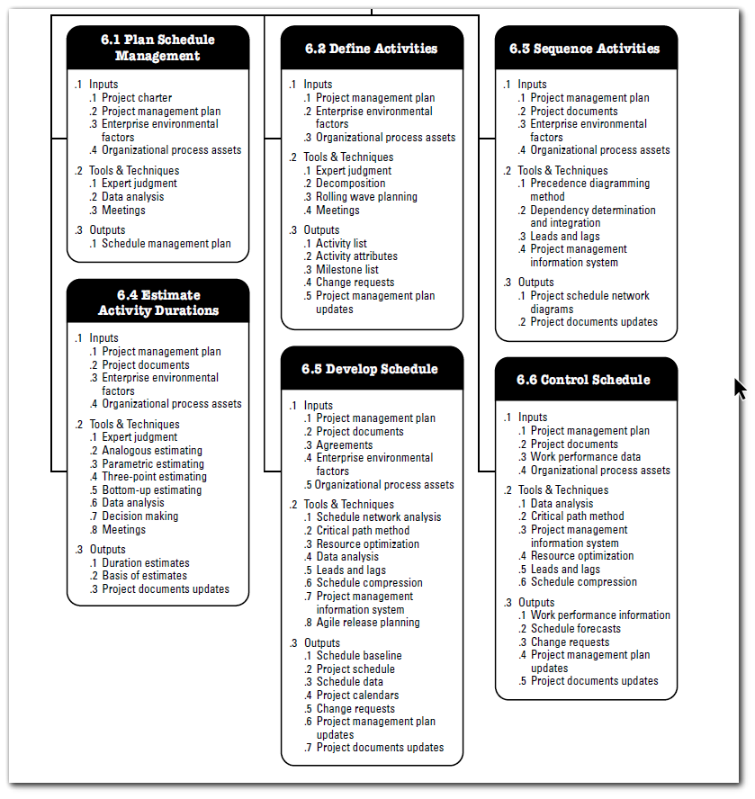
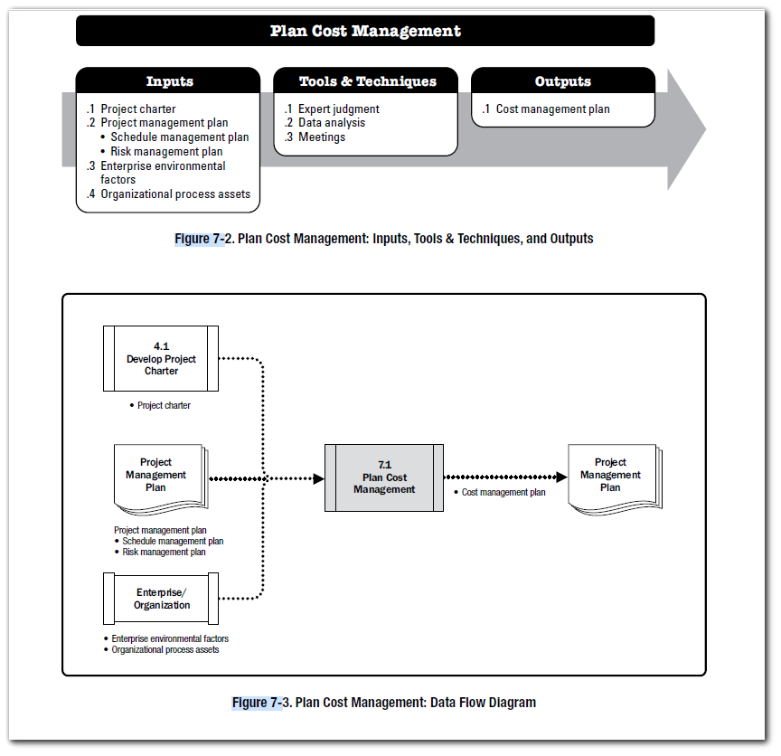

01

# Perform Integrated Change Control

# Bhau
Project Schedule Management

Resource leveling. A technique in which start and finish dates are adjusted based on resource constraints with
the goal of balancing the demand for resources with the available supply. Resource leveling can be used when
shared or critically required resources are available only at certain times or in limited quantities

Resource smoothing. A technique that adjusts the activities of a schedule model such that the requirements for
resources on the project do not exceed certain predefined resource limits. In resource smoothing, as opposed to
resource leveling, the project’s critical path is not changed and the completion date may not be delayed. In other
words, activities may only be delayed within their free and total float. Resource smoothing may not be able to
optimize all resources.

