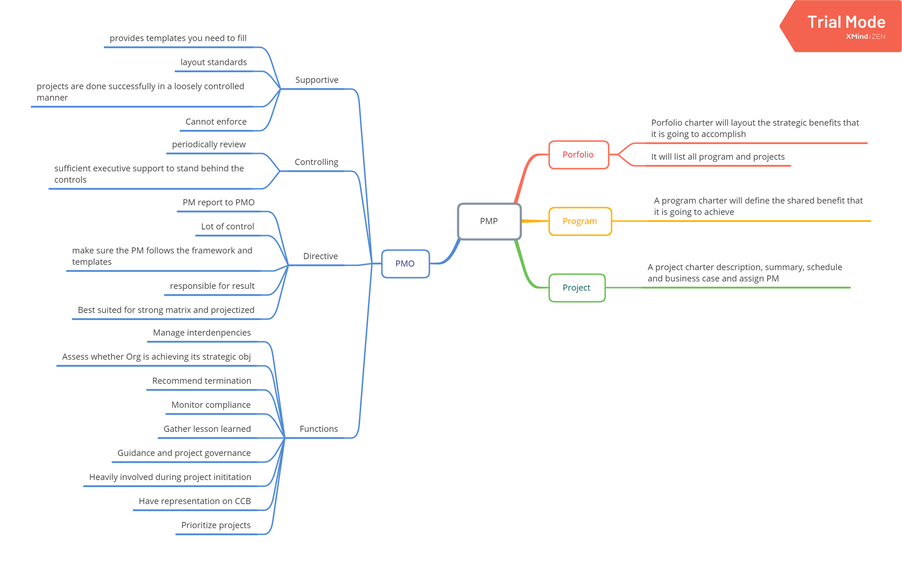
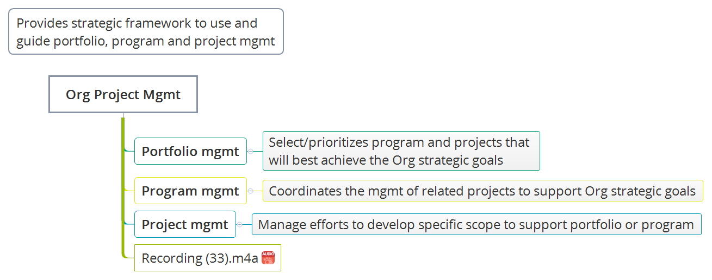
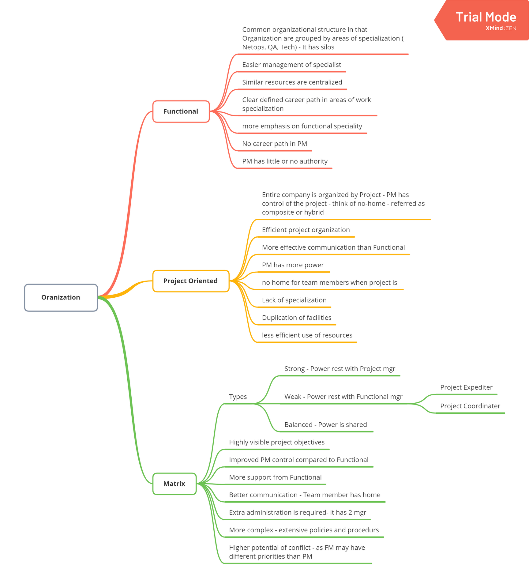
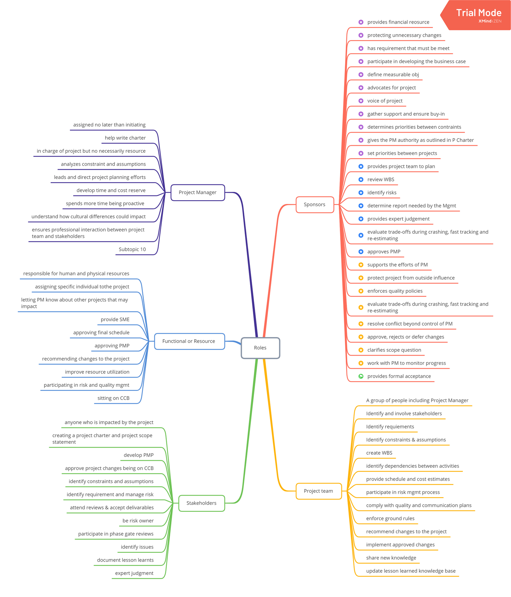
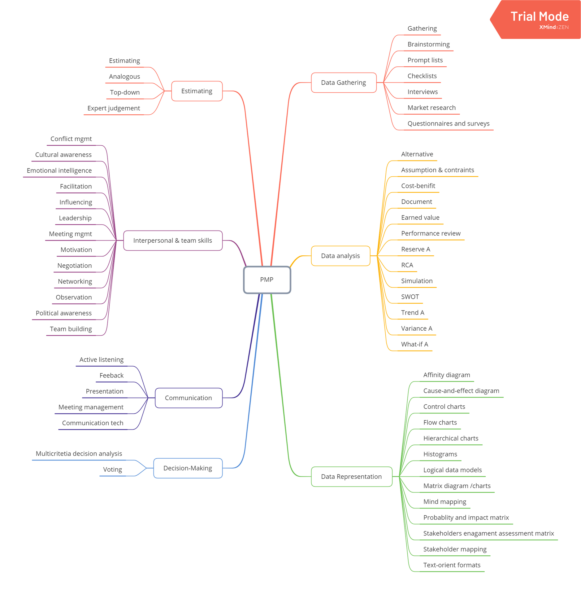

Framework

Good project manager 

**Knowlege**
- Learn what is going on in Project Management
- Learn from others success and mistakes

**Performance**
- It is all about keeping your nose to the grindstone and doing good work

**Personal skills**
- Keep personal connections and help keep everybody on the right track

`1A`

**PMO**
1. Supportive PMO
1. Controlling PMO
1. Directive PMO

**Interpersonal skills**
Influencing
Coaching
conflict Management
Poltical and cultural awareness

**Oraganization Types**

**Roles**

Sponsors
	provides financial reosurce
	protecting unnecessary changes
	has requirement that must be meet
	participate in developing the business case
	define measurable obj
	advocates for project
	voice of project
	gather support and ensure buy-in
	determines priorities between contraints
	gives the PM authority as outlined in P Charter
	set priorities between projects
	provides project team to plan
	review WBS
	identify risks
	determine report needed by the Mgmt
	provides expert judgement
	evaluate trade-offs during crashing, fast tracking and re-estimating
	approves PMP
	supports the efforts of PM
	protect project from outside influence
	enforces quality policies
	evaluate trade-offs during crashing, fast tracking and re-estimating
	resolve conflict beyond control of PM
	approve, rejects or defer changes
	clarifies scope question
	work with PM to monitor progress
	provides formal acceptance

Project team
	A group of people including Project Manager
	Identify and involve stakeholders
	Identify requiements
	Identify constraints & assumptions
	create WBS
	identify dependencies between activities
	provide schedule and cost estimates
	participate in risk mgmt process
	comply with quality and communication plans
	enforce ground rules
	recommend changes to the project
	implement approved changes
	share new knowledge
	update lesson learned knowledge base

Stakeholders
	anyone who is impacted by the project
	creating a project charter and project scope statement
	develop PMP
	approve project changes being on CCB
	identify constraints and assumptions
	identify requirement and manage risk
	attend reviews & accept delivarables
	be risk owner
	participate in phase gate reviews
	identify issues
	document lesson learnts
	expert judgment

Functional or Resource 
	responsible for human and physical resources
	assigning specific individual tothe project
	letting PM know about other projects that may impact
	provide SME
	approving final schedule
	approving PMP
	recommending changes to the project
	improve resource utilization
	participating in risk and quality mgmt
	sitting on CCB

Project Manager
	assigned no later than initiating
	help write charter
	in charge of project but no necessarily resource
	analyzes constraint and assumptions
	leads and direct project planning efforts
	develop time and cost reserve
	spends more time being proactive 
	understand how cultural differences could impact
	ensures professional interaction between project team and stakeholders
	

**Tools & Techniques**

**Data Gathering**
	Gathering
	Brainstorming
	Prompt lists
	Checklists
	Interviews
	Market research
	Questionnaires and surveys

**Data analysis**
	Alternative
	Assumption & contraints
	Cost-benifit
	Document
	Earned value
	Performance review
	Reserve A
	RCA
	Simulation
	SWOT
	Trend A
	Variance A
	What-if A

**Data Representation**
	Affinity diagram
	Cause-and-effect diagram
	Control charts
	Flow charts
	Hierarchical charts
	Histograms
	Logical data models
	Matrix diagram /charts
	Mind mapping
	Probablity and impact matrix
	Stakeholders enagament assessment matrix
	Stakeholder mapping
	Text-orient formats

**Decision-Making**
	Multicritetia decision analysis
	Voting

**Communication**
	Active listening
	Feeback
	Presentation
	Meeting management
	Communication tech

**Interpersonal & team skills**
	Conflict mgmt
	Cultural awareness
	Emotional intelligence
	Facilitation
	Influencing
	Leadership
	Meeting mgmt
	Motivation
	Negotiation
	Networking
	Observation
	Political awareness
	Team building

**Estimating**
	Estimating
	Analogous
	Top-down
	Expert judgement

## Chapter three Project Management Process

Project life cycle - what you need to do to do the work
Project Management process - what you need to do to manage the work

 **Plan Driven** 
It has predictive life cycles - waterfall 
It requried scope, schedule and cost to be determined early in the life of the project
Change Driven
It uses iterative, incremental or adaptive 
The complete concept is build in successive level
Hybrid Development 
It is combination of predictive and adaptive development life cycle

Initiating
Planning
Executing
Monitoring & Controlling
Closing

Small project with Predicitve cycle
Research -- Design -- Code -- Test -- Transition

Large project with a predictive life cycle with phase gate
Feasiblity || Planning || Design || Production || Turnover || Start-up

